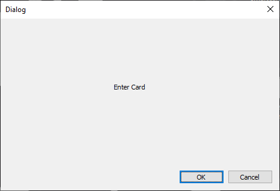
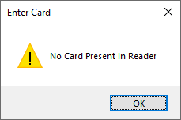
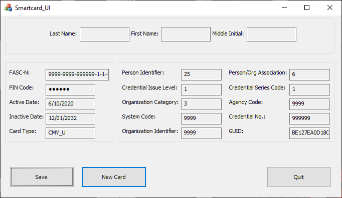
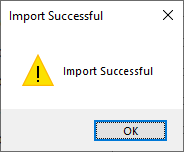

TODO
x1. Explain what this project does

2. Use pictures 1 paragraph at a time for all possible outcomes during runtime

x3. Willing to upload MSI file upon request

# Smartcard_UI
This is the most up to date WORKING version of the Smartcard_UI application. 
I am willing to upload an MSI file upon request. 
This is a program utilizing MFC, C++, and SQL with QLM as a third party licensing software and MSI as the installer. 
The only hardware used is an HID Omnikey card reader and a set of smart cards. 
Tested smart cards include: PIV, PIV-I, CaC, DoD, TWIC, and DHS. 
Smartcard_UI was made to make extracting data off of government smart cards a simple process. 
Smartcard_UI gets your cards FASC-N number and parses it into 10 individual codes which include: Person Identifier, Credential Issue Level, Organization Category, and more. 
After extracting all this information and displaying it to the user, that data can be submitted to a database for future use. 
##
## Running the Program
After installing the program, entering your license information for QLM, and going through first time setup, you will see the home screen. 
Here you can see all the information that is going to be extracted from the card. 
Click on the "New Card" button when you are ready to continue. 

##
You will be prompted to enter a card into the card reader. 

##
If you click the "ok" button and the reader does not recognize a card, it will display what is shown below. 

##
After entering a card you are prompted to enter the PIN number of your card. If you enter an invalid PIN, you will be shown how many attempts you have left until the card is locked. 

##
After entering a valid PIN, you are sent back to the home screen with values filled into all the text boxes. 
As long as everything looks good, press the "Submit" button to upload all this information to a database for future use. 

##
If the information is successfully uploaded to the database, you will be shown that it was successful.
If the information failed to upload, you will be shown that it failed somehow. 
Since this program is using a local SQL server, the information will fail to upload to a database unless you look through the source code and build your own server (or alter the code to fit your own server).

##

## License
Copyright © 2020, [Austin Draper](https://github.com/Austin-Draper). Released under the [MIT License](LICENSE).
