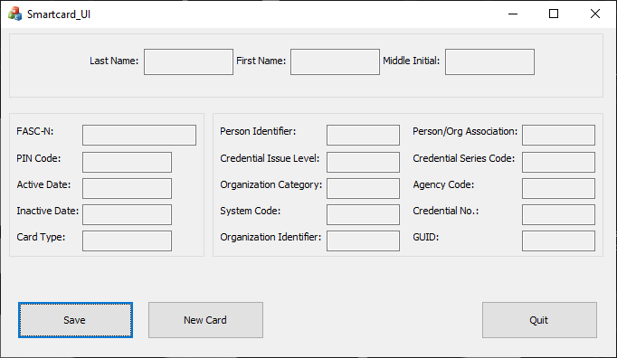

TODO
1. Explain what this project does

2. Use pictures 1 paragraph at a time for all possible outcomes during runtime

3. Willing to upload MSI file upon request

# Smartcard_UI
This is the most up to date WORKING version of the Shopping_List application
This is a program utilizing Qt, C++, MySQL with XAMPP, and a third party service "Twilio" to create a shopping list application with SMS messaging functionality. Twilio takes the users input and sends their phone a text message of their shopping list items. 
The twilio_cpp_demo folder was taken directly off the twilio website and the cpp_demo.cc file has been altered to fit this applications needs.
##
## Running the Program
Since this program is using a local MySQL server, this program will not run unless you look through the source code and build your own server (or alter the code to fit your own server). There is a word document called "UserManual" that shows everything this application is capable of in detail with pictures.
Listed below is a picture of what the main application looks like.

##
## License
Copyright © 2020, [Austin Draper](https://github.com/Austin-Draper). Released under the [MIT License](LICENSE).
